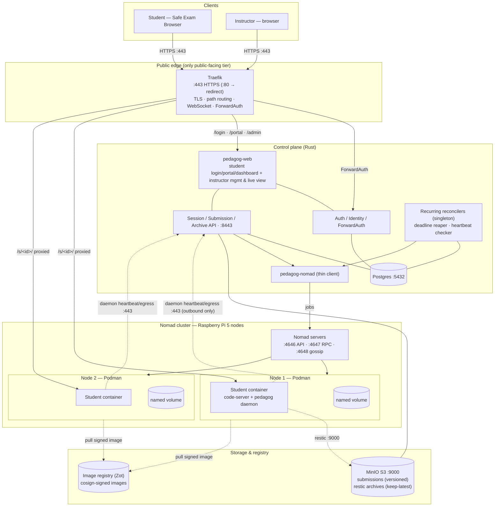
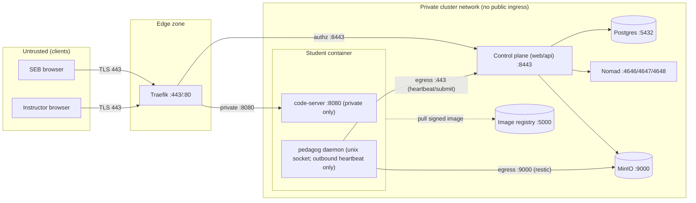
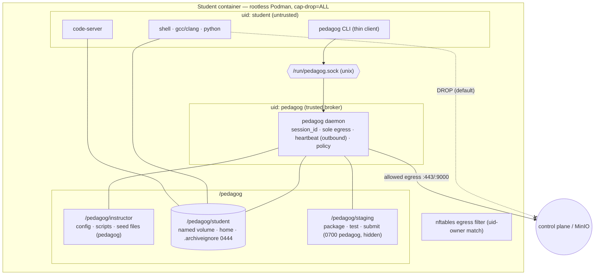
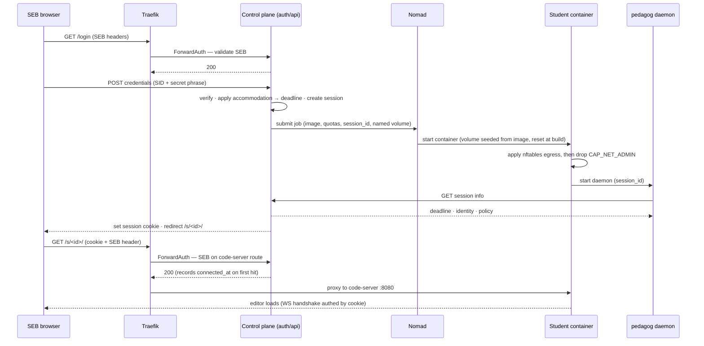
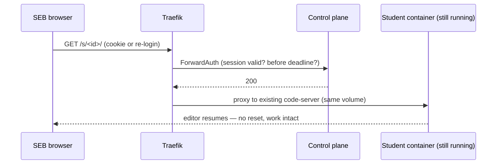
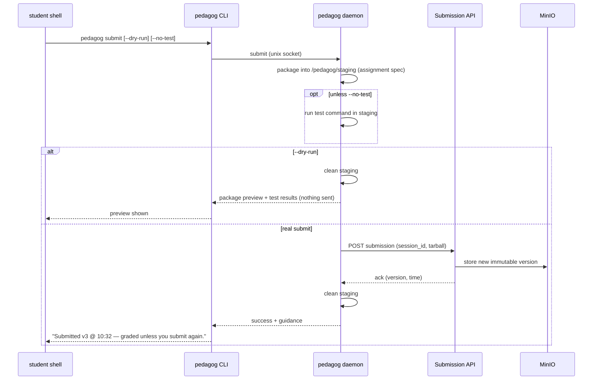
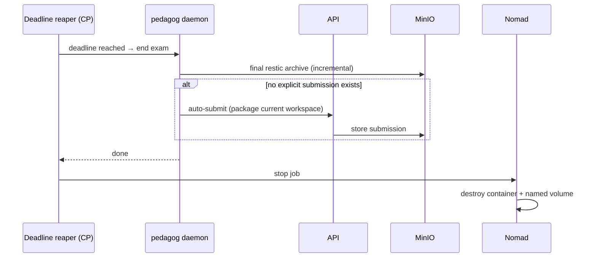
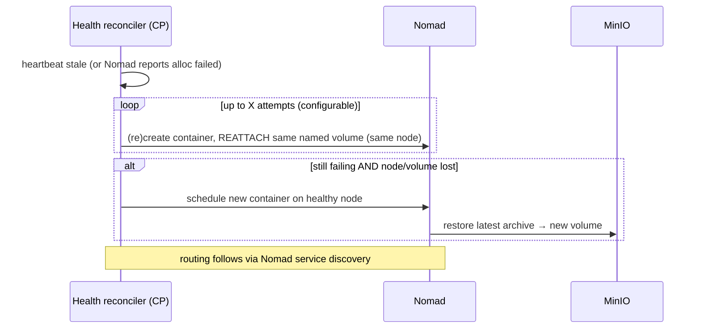
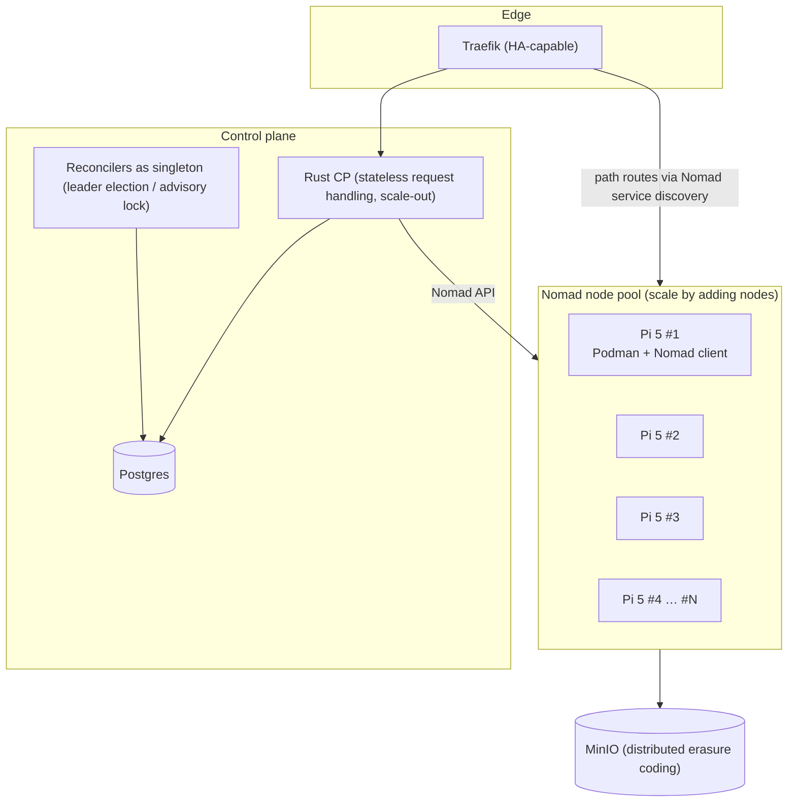

# 02 — Design: Browser-Based Coding Exam System

> **Date:** 2026-06-20
> **Status:** Agreed (v1 architecture). Implements the requirements in
> [`01-prompt-exam-system-overview.md`](./01-prompt-exam-system-overview.md).
> Diagrams are [Mermaid](https://mermaid.js.org/) and render on GitHub / most Markdown viewers.

---

## 1. Goals & non-goals

### Goals (v1)
- Administer coding exams entirely in a locked-down browser (**SEB** first).
- Per-student, **ephemeral, restricted** container running **`code-server`** (browser VS Code).
- Strong **student isolation**: no internet by default, no privilege escalation, no access to
  secrets or the submission pipeline.
- **Versioned submissions**, automatic **deadline submission**, and always-on **archival** for
  instructor recovery.
- **Instructor management** UI for assignments, accommodations, live monitoring, and recovery.
- **Multi-host from day one** (e.g. a cluster of Raspberry Pi 5s), scheduled by **Nomad**.
- **No student data loss** during an exam, even across container/node failures.
- Auth via custom **student ID + secret phrase**, behind a pluggable **identity provider** so
  **Canvas LTI 1.3** drops in later.

### Non-goals (v1, deferred)
- Automated grading with points / hidden tests / Canvas grade passback.
- Respondus Lockdown Browser (target via Canvas later).
- Live container migration (we use restore-from-archive instead).

---

## 2. Key technologies & where they run

| Concern | Choice | Notes |
|---|---|---|
| Browser editor | **code-server** | Supports clean path-based reverse-proxy routing |
| Locked browser | **Safe Exam Browser (SEB)** | Header validation (`RequestHash` / `ConfigKeyHash`) |
| Reverse proxy / edge | **Traefik** | TLS, path routing, WebSockets, ForwardAuth |
| Control plane | **Rust** | Auth, API, lifecycle, reconcilers; **authority for time**; idiomatic, typed |
| Web UI | **Rust** (`pedagog-web`) | Student login/portal/dashboard + instructor management & live view |
| In-container broker | **Rust** `pedagog` daemon | Holds `session_id`; sole outbound egress; **pushes heartbeat** (no inbound); policy |
| Nomad access | **Rust** `pedagog-nomad` (thin) | `reqwest`/`serde` wrapper over the few HTTP endpoints we use — not a full client port |
| Image registry | **Zot** (or Harbor) | Private OCI registry; cosign-signed images pulled by nodes |
| Scheduling / multi-host | **Nomad** + `nomad-driver-podman` | Placement, health, reschedule |
| Containers | **Podman** (rootless) | Per-student container |
| Base image | **Wolfi** | Small, glibc, ~0 CVE |
| Object storage | **MinIO (S3)** | Submissions + restic archives |
| Incremental archive | **restic** | Dedup, encrypted, keep-latest-only |
| Relational state | **Postgres** | Sessions, students, assignments, accommodations, audit |

---

## 3. High-level architecture



**Trust boundary:** Traefik is the *only* tier reachable from clients. The control plane, Nomad,
Postgres, MinIO, the registry, and the containers' code-server ports live on a private network and
are never directly exposed. **The control plane never reaches *into* containers** — containers only
reach *out* (heartbeat + submit/archive); recovery is driven by stale heartbeats, not by polling.
The instructor surface lives in `pedagog-web` behind a privileged (instructor-role) auth path.

---

## 4. Network & security architecture

### 4.1 Trust zones and ports



- **Public:** `:443` (HTTPS) and `:80` (redirect) on Traefik only.
- **Private:** control plane `:8443`, Postgres `:5432`, Nomad `:4646/4647/4648`, MinIO `:9000`,
  each container's code-server on a private `:8080`.
- The private network is a closed cluster LAN (optionally WireGuard between nodes). Consider mTLS
  between Traefik↔control plane↔services as a hardening step.

### 4.2 In-container layout & privilege split

The **`student` user is untrusted**; a separate **`pedagog` daemon** is the trusted broker that
holds the `session_id`, is the **sole process with outbound egress**, and enforces all policy. It
**pushes heartbeats to the control plane** — the control plane **never connects *into* the
container**, so liveness is inferred from heartbeats, not polling. The student talks to the daemon
over a Unix socket.

Everything lives under **`/pedagog/`**:

| Path | Owner / access | Purpose |
|---|---|---|
| `/pedagog/instructor/` | pedagog (student: none) | Instructor config/scripts + seed files copied into the student dir |
| `/pedagog/student/` | student (named volume) | Student home/working dir; holds a **read-only copy of `.archiveignore`** seeded from `/pedagog/instructor/` |
| `/pedagog/staging/` | pedagog `0700` (student: none, hidden) | Package a submission here, run the test script, then clean; also the source for submitting/archiving to the server |



**Enforcement details:**
- **Network:** the container *has* a network; egress for the `student` uid is filtered by
  **nftables `owner`/uid match**. The (build-defined) ruleset is **applied at container start** —
  it must be, because the network namespace only exists at runtime — while holding
  **`CAP_NET_ADMIN`**, which is then dropped so the student cannot rewrite the firewall. Three
  instructor-facing modes (easy opt-out):
  - `network: none` *(default)* — student egress dropped; daemon egress allowed.
  - `network: allowlist` — student egress allowed only to instructor-listed hosts/CIDRs
    (e.g. a cybersec target). Names via `/etc/hosts`; port 53 stays closed to recursive resolvers
    (prevents DNS-tunnel exfiltration).
  - `network: open` — full opt-out (instructor's choice).
- **Capabilities:** `--cap-drop=ALL`; no sudo, no setuid escalation; no apt (removed at build).
- **No student-readable secret** exists anywhere; `session_id` lives only in the daemon.

### 4.3 SEB validation

SEB attaches per-request headers derived from the URL plus keys tied to the `.seb` config:
- `X-SafeExamBrowser-RequestHash` = `SHA256(URL + BrowserExamKey)`
- `X-SafeExamBrowser-ConfigKeyHash` = `SHA256(URL + ConfigKey)`

The control plane stores each assignment's `ConfigKey`/`BrowserExamKey` and validates via Traefik
**ForwardAuth** on:
- **(a)** the **entry/login** path, and
- **(b)** the route that serves the **code-server page**.

After (b), a short-lived **`HttpOnly; Secure; SameSite`** session cookie is set. The **WebSocket
handshake is authorized once, at the handshake, by that cookie** — not per frame, and not via SEB
headers (a browser WebSocket cannot set custom headers, and SEB header presence on WS upgrades is
unreliable). Subsequent code-server asset/WS traffic rides the cookie.

---

## 5. Control plane (Rust)

### 5.1 Responsibilities
- **`pedagog-web`** — one app serving:
  - **Student** login, portal, and **dashboard** showing the **single active session** with an
    **End session** action (one active session per student across *all* assignments; they must end
    the current one to start another). Entry path is behind SEB validation.
  - **Instructor** management (privileged, instructor-role path): create/manage assignments, set
    **accommodations**, a **live monitor** of active sessions (who's connected, time remaining),
    **grant time live**, broadcast messages, and **view/download archives & submissions** to fix
    or re-submit on a student's behalf.
- **Auth/Identity + ForwardAuth** — login, SEB validation, session-cookie issuance, the
  `/authz` endpoint Traefik calls per request.
- **Session/Submission/Archive API** — endpoints the `pedagog` daemon calls (fetch session info,
  report connect time, **receive heartbeat**, store submission, register archive).
- **Authority for time** — the control plane owns the clock: it computes each session's `deadline`
  and the **deadline reaper** enforces it. The daemon only *reads* the deadline from the CP; it
  never decides when the exam ends.
- **Session lifecycle** — translates "create/stop a session" into Nomad jobs via `pedagog-nomad`.
- **Recurring reconcilers (run as a singleton — leader election or Postgres advisory lock so
  scaled-out replicas don't double-act):**
  - **deadline reaper** — per-student deadline → final archive → auto-submit if none → teardown.
  - **heartbeat checker** — scans `last_seen`; drives the recovery loop (§7.5).
- **State** — Postgres.

### 5.2 Rust workspace layout (clear separation of work)

```
pedagog/
├── Cargo.toml                 # workspace
├── crates/
│   ├── pedagog-core/          # domain types: Session, Assignment, Submission,
│   │                          #   Accommodation, Identity, errors. No I/O.
│   ├── pedagog-proto/         # wire DTOs shared by control plane ⇄ daemon ⇄ CLI
│   ├── pedagog-identity/      # IdentityProvider trait + `custom` (v1) + `lti` (v2)
│   ├── pedagog-control/       # backend: auth, ForwardAuth, session/submission/archive API,
│   │                          #   lifecycle, reaper + heartbeat reconciler
│   ├── pedagog-web/           # one web app: student login/portal/dashboard + instructor mgmt
│   ├── pedagog-nomad/         # thin reqwest/serde wrapper over the Nomad HTTP endpoints we use
│   ├── pedagog-daemon/        # in-container broker daemon
│   ├── pedagog-cli/           # `pedagog` (student + installer subcommands)
│   └── pedagog-storage/       # MinIO/S3 + restic wrappers
├── images/
│   ├── base/                  # Wolfi base (apko/melange) + pedagog binaries (daemon, cli)
│   ├── control-plane/         # image for pedagog-control
│   └── web/                   # image for pedagog-web
└── deploy/                    # nomad/ traefik/ minio/ postgres/ registry/ configs
```

> **Assignment images are NOT in this repo.** Instructors build them from the published `base`
> image. This repo holds the base image and the infra (control-plane / web) images only.

Boundaries: `pedagog-core` is pure domain (no I/O), `pedagog-proto` is the shared contract,
side-effecting crates depend inward only. Identity is a trait so v1 `custom` and v2 `lti` are
swappable without touching auth flow. `pedagog-web` serves both audiences but separates the
public student routes from the privileged instructor routes (distinct auth, tighter network path).

### 5.3 Data model (sketch)

- **student**: `sid`, `name`, `email`, `alias`, … (whatever the `IdentityProvider` exposes).
- **instructor / role**: who may access `pedagog-admin`.
- **assignment**: image ref, `network_mode`, quotas, package/prepare spec, test command,
  default time limit, **exam window** (`open_at`/`close_at`), SEB `ConfigKey`/`BrowserExamKey`.
- **accommodation**: `(student, assignment) → multiplier | fixed_duration`.
- **session**: `session_id` (capability token), student, assignment, node/alloc, named volume,
  `start_at`, `deadline` (after accommodations), `connected_at`, `last_seen` (heartbeat), state.
- **submission**: `(session, version, time, object_key)` — versioned, immutable.
- **archive**: `(session, latest object/restic snapshot, time)` — keep-latest only.
- **audit_log**: connections, command usage, submissions, instructor actions (integrity disputes).
- **Invariant:** at most **one active (non-terminal) session per student** across *all* assignments;
  the student must **End session** on their dashboard before starting another.

### 5.4 Images & registry

- Images are built from the published **Wolfi `base`** and pushed to a private **Zot** registry
  (lightweight, CNCF, arm64-friendly — **Harbor** if a full UI/RBAC/scanning is wanted later).
- Images are **multi-arch (arm64 for the Pis)** and **signed with cosign**; nodes verify the
  signature at pull (Podman/Nomad pull policy), protecting the supply chain into the cluster.
- Assignment images are built by instructors from `base` and pushed to the same registry.

---

## 6. Storage & data lifecycle

- **Submissions:** versioned, immutable objects in MinIO. Each `pedagog submit` = a new version.
  Grading uses the **last explicit submission**, or — only if none exists — the deadline
  auto-submission.
- **Archives:** **restic** repo per session in MinIO. Incremental (only changed chunks uploaded),
  **retention = keep-last-1** (prune older). Excludes paths in `/pedagog/student/.archiveignore`
  (`target/`, `.venv`, …). Runs in the daemon's **reserved cgroup**, streamed, low compression →
  ~tens of MB RAM, invisible to the student.
- **Cadence:** restic snapshot every ~2 min **and** on each `submit`, on disconnect, and at the
  deadline (B + D).
- **Volume lifecycle:** the named volume is **seeded at first mount from the image content at
  `/pedagog/student/`** (Podman copy-up) — i.e. the build-time `reset` populates it. It **survives
  container restarts and new containers on the same node** for the whole session, and is
  **destroyed at teardown** (deadline, after final archive). Node/volume loss → restore latest
  archive into a fresh volume on a healthy node.

---

## 7. User & system flows

### 7.1 Provisioning / first login (lazy: container created on first auth)

`reset` runs at **image build** (as the `student` user, the last build step), so the runtime flow
is minimal: the named volume is seeded from the image, and the only runtime init is applying the
egress rules.



### 7.2 Reconnect (laptop restart, mid-exam)



### 7.3 Submit (dry-run still tests unless `--no-test`)



### 7.4 Deadline teardown



### 7.5 Failure recovery (health reconciler)

Try a **new container with the same named volume first**; only if the node/volume is lost do we
restore the latest archive into a new volume.



---

## 8. Quotas & resilience (instructor-configurable at image build)

| Knob | Purpose | Default sketch |
|---|---|---|
| `memory_limit` + `memory_reservation` | Cap student; **reserve memory for daemon** so archive/submit always run | toolchain-dependent; benchmark on RPi 5 |
| `pids_limit` | Fork-bomb protection | ~512 |
| `cpu` | One student can't starve a node | 1–2 cores |
| `disk_quota` (XFS project quota) | Prevent filling the node; **headroom + streamed archive** | ~4 GB (Rust `target/` needs much more) |
| `inode_limit`, `ulimits`, tmpfs `/tmp` size | Exhaustion protection | sane caps |
| `restart_attempts` (X) | Health-loop restart budget before restore | configurable |

**Data-loss-prevention principles:** (1) work lives on the **named volume** (`/pedagog/student`),
never the container writable layer; (2) daemon runs in a **reserved cgroup** so archival survives
memory pressure; (3) **stream** archives (no 2× disk/RAM); (4) let the kernel OOM-kill the
offending process, not the workspace.

---

## 9. Scaling



- **Placement is Nomad's job** (bin-packing across nodes) — we never compute placement ourselves.
- **Scale out** by adding Nomad client nodes; MinIO scales by adding drives/nodes.
- **Stateless request handling, singleton reconcilers.** The CP scales out for HTTP/ForwardAuth,
  but the **deadline reaper** and **health/heartbeat checker** must run as a singleton (leader
  election or a Postgres advisory lock) so replicas don't double-act. Daemons **push heartbeats**
  (egress) updating `last_seen`; the reconciler scans Postgres for stale sessions and drives
  recovery (§7.5) and teardown (§7.4).
- **What the control plane still owns** (not provided by Nomad): exam domain logic, student↔alloc
  mapping + reconnect, volume/archive recovery, deadline lifecycle, Traefik routing config.
- **Capacity is bounded by per-session memory** (code-server + language servers like `clangd` /
  Pyright). **Must benchmark students-per-Pi on real RPi 5 hardware** before sizing a class.

---

## 10. `pedagog` CLI surface (v1)

**Installer (build time):**
- `pedagog image install rust | c_gcc | python_uv | typst | latex_minimal | …`
- `pedagog image restrict apt | network[=none|allowlist|open] | …`

**Student (run time, brokered by daemon):**
- `pedagog submit [--dry-run] [--no-test] [--to=dir/url] [--overwrite]`
- `pedagog reset` — restore skeleton (also run at **build**, as `student`, as the last build step)
- `pedagog test` — package a submission and run the assignment's test command (e.g. `cargo test`)
- `pedagog time` — remaining time
- `pedagog archive [--to=dir/url]` — archive whole student dir (also automatic at teardown)
- `pedagog help`

> Note: `unsubmit` is **removed** (superseded by versioned submissions + "auto-submit only if
> none exists").

---

## 11. Identity provider abstraction

`pedagog-identity` defines an `IdentityProvider` trait exposing **name(s), SID, email, alias**, etc.
v1 ships `custom` (student ID + secret phrase). v2 adds `lti` (Canvas LTI 1.3: SSO + roster via
Names & Roles, and later grade passback via AGS) with **no changes to the auth flow**.

---

## 12. Threat model (summary)

| Threat | Mitigation |
|---|---|
| Student exfiltrates data / reaches LLM | Default `network: none` via nftables uid-owner; no port 53 to recursive resolver |
| Student tears down firewall | Rules applied under `CAP_NET_ADMIN` at start, then dropped; `cap-drop=ALL` |
| Student reads/forges submission token | `session_id` held only by `pedagog` daemon; `/pedagog/staging` & `/pedagog/instructor` `0700 pedagog` |
| Submit after deadline / as another student | Server-validated `session_id` + per-session deadline; daemon-only egress |
| Broke working code after submitting | Versioned submissions; grade = last explicit submission |
| Non-genuine / tampered browser | SEB header validation on entry + code-server route |
| Replay session cookie outside SEB | Short-lived `HttpOnly/Secure/SameSite` cookie minted only after SEB-validated loads |
| Credential sharing / two simultaneous logins | **One active session per student** enforced; reconnect supersedes; new assignment requires ending current |
| Tampered / poisoned image | cosign-signed images verified at pull from the private registry |
| Fork bomb / disk fill / OOM | pids/cpu/memory/disk/inode quotas; reserved cgroup for daemon |
| Container/node failure mid-exam | Persistent named volume + restart-X-times + restore-latest-archive |
| Brute-force secret phrase | Hash at rest (argon2); rate-limit + lockout on login |
| Data privacy (FERPA) | University-hosted, encrypted-at-rest storage; restic-encrypted archives; audit log |

---

## 13. Open items / future work
- **Benchmark** code-server + `clangd`/Pyright memory on real **RPi 5** → students-per-node.
- **Empirically verify** SEB header behavior with code-server (entry + page route + WS handshake).
- **Exam-start thundering herd** *(future):* lazy provisioning means N students spin up containers
  at once at the start bell. A **pre-warm pool** / staggered admission would avoid a load spike.
- **Live website viewing** *(future, nice-to-have):* a second proxied path into the container so
  students can run a server and view it in the browser (reshapes routing — out of v1 scope).
- **Image build details:** multi-arch (arm64) builds, cosign key management & verify policy,
  registry GC/retention.
- **Secret-phrase handling:** generation/distribution, hashing (argon2), rate-limit/lockout.
- **Audit logging** surface for academic-integrity disputes; backups for Postgres/MinIO.
- **Clock sync (NTP)** across nodes (the control plane is authoritative for deadlines).
- Memory-efficient LSP selection per toolchain (deferred to install-recipe work).
- v2: Canvas LTI 1.3 (SSO, roster, grade passback), points/hidden-test grading, Respondus path.
- Decide Postgres HA topology and MinIO erasure-coding layout for the target cluster size.
- Internal mTLS between tiers (hardening).
