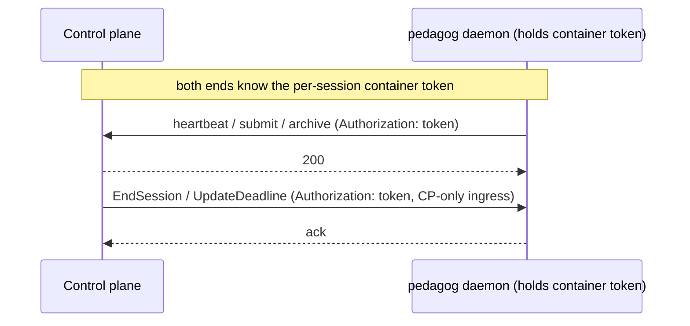
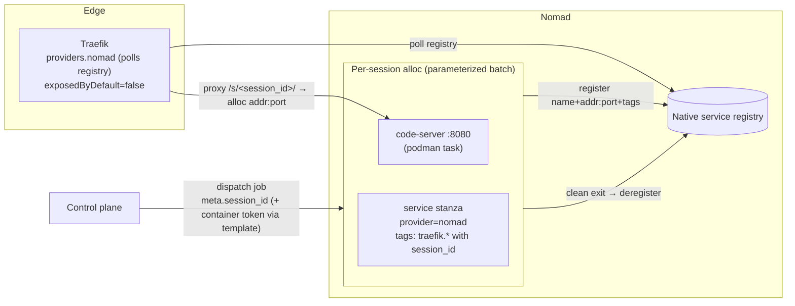

# 08 — Design: Dynamic Path Routing via Nomad

> **Date:** 2026-06-21
> **Status:** **Agreed** (2026-06-21). Implements
> [`08-prompt-dynamic-routing.md`](./08-prompt-dynamic-routing.md). Refines the routing pieces of
> [`02-design-exam-system.md`](./02-design-exam-system.md) (§3, §4.2, §4.3, §7, §9) and the
> in-container control channel in [`03-prompt-base-image-daemon.md`](./03-prompt-base-image-daemon.md),
> and supersedes the throwaway static config from the M1.5 spike.
> No configs/jobspecs are written from this doc until it is marked **Agreed**.

---

## 1. What changes and why

The M1.5 spike proved code-server works under a `/s/<id>/` subpath, but it routed via a **static
Traefik file provider** with a single hand-written `/s/test` router/service/middleware
(`deploy/spike-path-routing/dynamic.yml`). That cannot scale: every session would need its route
written and removed by hand, and the upstream `url` was a fixed `http://cs:8080`.

We replace that with **discovery-driven routing**: each per-session container registers itself in
**Nomad's native service registry** with **Traefik tags** that encode its `/s/<session_id>/` rule,
and **Traefik's `nomad` provider** turns those registrations into routers/services automatically.
Routes **appear** when the alloc is running and registered, and **disappear** when it stops — with
no per-session file edits.

This is exactly the shape doc 02 already drew ("path routes via Nomad service discovery").

---

## 2. Terminology: `session_id` (public, routable) vs the container token (secret)

A correction carried in from the follow-up to the prompt. There are **two distinct values**, and
earlier docs conflated them under the name `session_id`:

| Value | Visibility | Where it appears | Role |
|---|---|---|---|
| **`session_id`** | **Public**, opaque, stable | URL/route `/s/<session_id>/`, Nomad service tags, dashboard, logs, audit | **Identifies** a session. **Carries no authority.** Used directly as the route. |
| **container token** | **Secret**, high-entropy | Only inside the CP and that session's daemon (Nomad `meta` → `template` → tmpfs `0400 pedagog`) | **Authenticates** the session's control channel **both ways** (see §3). Never in a URL/tag/log. |

Consequences:
- The separate `route_id` from the earlier draft is **gone** — we route on `session_id` directly.
- Access to `/s/<session_id>/` is still gated by **ForwardAuth (SEB) + the session cookie**
  (doc 02 §4.3); the `session_id` being public is fine because it is not an authenticator. It should
  still be high-entropy enough to be non-enumerable (defense in depth).
- Per the code conventions (doc 05 §4) these are two newtypes: `SessionId` (already planned) and a
  new `ContainerToken`. `ContainerToken` must never be `Display`/logged; `SessionId` may be.
- **Docs 02 and 03 use `session_id` to mean the secret and must be reconciled** to this split
  (see §10).

---

## 3. The container token authenticates the CP↔container control channel

Because the container token is a secret shared by **exactly** the CP and one session's daemon, it
is a **bidirectional bearer credential** for that session's control channel:

- **daemon → CP** (outbound, doc 02 §5.1): heartbeat / submit / archive — the token proves
  "I am session X's daemon."
- **CP → daemon** (inbound, doc 03 control endpoint): `EndSession` (kill) / `UpdateDeadline`
  (send updates) — the token proves "I am the CP, authorized for session X."



**This upgrades doc 03's control endpoint.** Doc 03 planned to authenticate the CP→daemon endpoint
by **nftables only** ("no signing for v1"). With the container token it becomes **nftables-restricted
*and* token-authenticated** — defense in depth:
- nftables limits *who can connect* to the control port (CP address only; student uid denied);
- the token ensures the daemon *only acts on commands that prove knowledge of the session secret*,
  so an nftables misconfig or a same-netns surprise alone is not sufficient to issue commands.

Properties:
- **Blast radius:** a leaked token compromises **one session**, not the fleet (no single global CP
  credential on the wire).
- **Transport:** pair with **TLS on the private net** (doc 02's mTLS hardening) so the bearer token
  isn't sniffable; otherwise a private-net eavesdropper could capture it. (v1 minimum: nftables +
  token; TLS strongly recommended.)
- **Addressing:** the daemon's control port is a **private** registered port (not Traefik-exposed);
  the CP discovers the alloc address the same way Traefik does (Nomad), or from the alloc record it
  already holds. This keeps "Traefik is the only public tier" intact.
- **Resolves the doc 02 vs 03 tension:** doc 02 follow-up #3 said "no inbound"; doc 03 reversed to
  "inbound push." The model here is explicitly **inbound push, authenticated by the per-session
  token** — that is the agreed shape.

---

## 4. Who owns what (reconciling "the CP owns routing")

Doc 02 §9 says the control plane "still owns … Traefik routing config." That stays true, but the
ownership is over the **decision**, not the file:

| Concern | Owner |
|---|---|
| Choosing the `session_id` and the `PathPrefix` rule for a session | **Control plane** (sets it as Nomad `meta` at dispatch) |
| Registering the running instance + its address:port + tags | **Nomad** (native service registry, from the jobspec `service` stanza) |
| Discovering registrations and building routers/middlewares | **Traefik** (`nomad` provider) |
| Removing the route when the session ends | **Nomad** deregisters on alloc stop → Traefik drops it |

So the CP never writes Traefik config files. It expresses intent **once**, as job metadata, and the
orchestrator + edge converge on it. This also gives free **reconnect/reschedule routing**: a
rescheduled alloc (§7.5) re-registers the same tags with its new address, and Traefik follows it.

---

## 5. Architecture



**Components / versions to pin (verify at spike time):**
- **Nomad** with **native service discovery** (`service { provider = "nomad" }`, Nomad ≥ 1.3) — no
  Consul.
- **`nomad-driver-podman`** task driver (rootless), per doc 02/07.
- **Traefik** with the **`nomad` provider** (`providers.nomad`, Traefik ≥ 2.8). It reads Nomad's
  service registry over the Nomad HTTP API and builds routers from tags.

---

## 6. The `codebox` job — `service` + tags

The implemented job is `deploy/nomad/codebox.nomad.hcl` (named **`codebox`**, not after the editor
program it runs). Two parameterization levels:

- **Per assignment** — `image`, `cpu`, `memory` are **HCL variables** supplied at `nomad job run`
  (the CP fills them from the assignment's registry image + quotas).
- **Per session** — `session_id` is **dispatch meta** (`nomad job dispatch -meta session_id=…`),
  interpolated into the service tags. The **container token** (secret) will be a second dispatch
  meta rendered by a `template` stanza to tmpfs `secrets/` (*not* a tag) — added with the daemon.

```hcl
variable "image"  { type = string }   # assignment image from the registry
variable "cpu"    { type = number }   # quota
variable "memory" { type = number }   # quota

job "codebox" {
  type = "batch"
  parameterized { meta_required = ["session_id"] }   # + "container_token" later

  group "box" {
    network { port "http" { to = 8080 } }

    service {
      name     = "codebox-${NOMAD_META_session_id}"
      provider = "nomad"
      port     = "http"
      tags = [
        "traefik.enable=true",
        "traefik.http.routers.s-${NOMAD_META_session_id}.rule=PathPrefix(`/s/${NOMAD_META_session_id}`)",
        "traefik.http.routers.s-${NOMAD_META_session_id}.entrypoints=web",
        "traefik.http.routers.s-${NOMAD_META_session_id}.middlewares=strip-s-${NOMAD_META_session_id}",
        "traefik.http.middlewares.strip-s-${NOMAD_META_session_id}.stripprefix.prefixes=/s/${NOMAD_META_session_id}",
        # later: entrypoints=websecure, a forwardauth middleware (SEB+cookie), TLS
      ]
      check { type = "tcp" port = "http" interval = "10s" timeout = "2s" }
    }

    task "editor" {                 # runs code-server; the daemon task joins this group later
      driver = "podman"
      config    { image = var.image  ports = ["http"] }
      resources { cpu   = var.cpu     memory = var.memory }
    }
  }
}
```

Notes:
- **`stripPrefix`** is required — the editor emits **relative** asset paths, so stripping
  `/s/<session_id>` renders correctly.
- **WebSocket** needs no special tag — Traefik proxies the upgrade automatically.
- The student has **no Nomad access**, so they cannot influence these tags; the CP is the only
  writer of the variables and meta.

---

## 7. Traefik provider config

The edge proxy config is `deploy/traefik/traefik.yml` (one standalone instance, not part of any job):

```yaml
providers:
  nomad:
    endpoint:
      address: "http://<nomad-host>:4646"   # private network only
    exposedByDefault: false                 # SECURITY: only services that opt in via traefik.enable
    # refreshInterval: 15s                   # discovery latency knob (see §9)
```

The throwaway **file provider** (`deploy/spike-path-routing/`) is **dropped** for session routing.
A file/dynamic provider may still be used for **static, non-session** routes (e.g. `pedagog-web`'s
`/login`, `/portal`, `/admin`), which are not discovery-driven.

---

## 8. Security considerations

- **`exposedByDefault=false`** is mandatory: only services that set `traefik.enable=true` get a
  route. Prevents any stray Nomad service from being inadvertently exposed.
- **Tag/rule injection:** `session_id` is interpolated into a Traefik **`PathPrefix(`…`)`** rule. A
  value containing a backtick, quote, or rule operator could alter the rule. Mitigation: the
  `SessionId` newtype validates a strict URL-safe charset **before** dispatch; the CP is the only
  source of `meta.session_id`; the student cannot reach Nomad. (Enforced at the type boundary per
  doc 05.)
- **Path is not authority:** `/s/<session_id>/` is gated by ForwardAuth (SEB) + session cookie
  (doc 02 §4.3). `session_id` being public is fine; the **container token** never appears in a
  URL/tag/log and is the only value that authorizes control actions.
- **Control channel:** authenticated by the per-session container token **and** nftables-restricted
  to the CP (§3); pair with private-net TLS so the token isn't sniffable.
- **Private control path:** Traefik reaches Nomad's API and the alloc address on the **private
  cluster network only**; nothing here changes the "Traefik is the only public tier" boundary.

---

## 9. Lifecycle & timing

- **Appear:** alloc starts → registers service → Traefik picks it up on its next poll
  (`refreshInterval`, default ~15s; tune lower for snappier exam starts). The provisioning flow
  (doc 02 §7.1) must tolerate this gap — the CP can **poll until the route is live** before
  redirecting the browser to `/s/<session_id>/`, or accept a brief "starting…" state.
- **Reconnect/reschedule (§7.5):** a new alloc for the same session re-registers the **same tags**
  (`session_id` is stable in `meta`) with its new address; Traefik follows. Short route-absent
  window during reschedule is acceptable (student reconnects).
- **Disappear:** clean exit at teardown (doc 03 §teardown) completes the batch alloc → Nomad
  deregisters the service → Traefik removes the router. `nomad stop` is the backstop.
- ~~**Trailing slash:** `/s/<id>` (no slash) should redirect to `/s/<id>/`.~~ **Done 2026-06-21** —
  code-server emits a relative redirect (`./?folder=…`), so a bare `/s/<id>` resolved to `/s/` and
  dropped the session id. Added one shared `redirectRegex` middleware `add-slash`
  (`deploy/traefik/dynamic.yml`, via the file provider), referenced by every session router as
  `add-slash@file` ahead of `stripprefix`. Matches only the exact `/s/<id>` (no sub-path, no slash),
  so sub-paths and already-slashed URLs don't loop.

---

## 10. Acceptance — **PASS** (2026-06-20)

Verified with a single-node Nomad agent (2.0.3) + `nomad-driver-podman` (0.6.4, rootless) and
Traefik (3.1, `providers.nomad`, `exposedByDefault=false`). Agent config in `deploy/nomad/agent.hcl`,
edge proxy config in `deploy/traefik/`, the per-session job in `deploy/nomad/codebox.nomad.hcl`,
runbook in `deploy/README.md`.

1. ✅ Dispatch (`-meta session_id=test`) → Nomad registered the service with the Traefik tags;
   `/s/test/` served the workbench (302 → 200), assets resolved under the subpath, and the
   **WebSocket** upgrade returned 101 through Traefik.
2. ✅ Stopping the alloc deregistered the service → `/s/test/` returned **404** within the refresh
   window (dynamic teardown).
3. ✅ A second dispatch (`session_id=test2`) produced an independent live `/s/test2/` while
   `/s/test/` stayed 404 (multi-session isolation).

> Note: the container token (§2/§3) is not exercised here — this spike validates routing only; the
> daemon + token land later. Traefik bound `:8080` (rootless cannot bind `:80`).

**Re-verified 2026-06-21 without `--network host` (cluster-shaped networking).** The agent now
advertises a routable IP via `{{ GetPrivateIP }}` (`deploy/nomad/agent.hcl`), and Traefik runs in
its own podman network (`pedagog-edge`), reaching the Nomad API via `host.containers.internal` and
backends via the advertised `<node-IP>:<dynport>`. `/s/demo/` and `/s/demo2/` each served 200
independently; `/s/demo/` returned 404 after its alloc was stopped while `/s/demo2/` stayed up. This
removes the host-networking shortcut and matches how Traefik would address real remote nodes.

---

## 11. Open items / to reconcile

- ~~**Update doc 02** to the `session_id` (public, routable) vs **container token** (secret)
  split.~~ **Done 2026-06-21** — see doc 02 §14 (and §3, §4.2, §5.3, §7.1, §12 updated). The
  "Nomad service discovery" routing prose still lives primarily here in doc 08.
- ~~**Update doc 03** to rename the injected secret to **container token** and record the control
  endpoint as **nftables + token-authenticated**.~~ **Done 2026-06-21** (doc 03 delivery + control-
  endpoint-auth bullets). Doc 01 follow-up #2 and doc 05 §8 / doc 07 also annotated.
- **Pin versions:** confirm minimum Nomad / Traefik versions for native-SD + the `nomad` provider
  at spike time.
- **`refreshInterval` vs exam-start herd:** tuning interacts with the deferred pre-warm pool
  (doc 02 §13). Decide a default.
- **Static vs discovered split:** confirm `pedagog-web`'s own routes (`/login`,`/portal`,`/admin`)
  stay on a file/static provider while only sessions are discovered.
- **Health check** on the code-server port (gate routing on readiness) — include in the spike or
  defer?
- **Trailing-slash redirect:** per-session tag vs. one global middleware — decide before M1.6.
- **Control-channel TLS:** decide whether v1 ships token+nftables only, or token+nftables+TLS.
